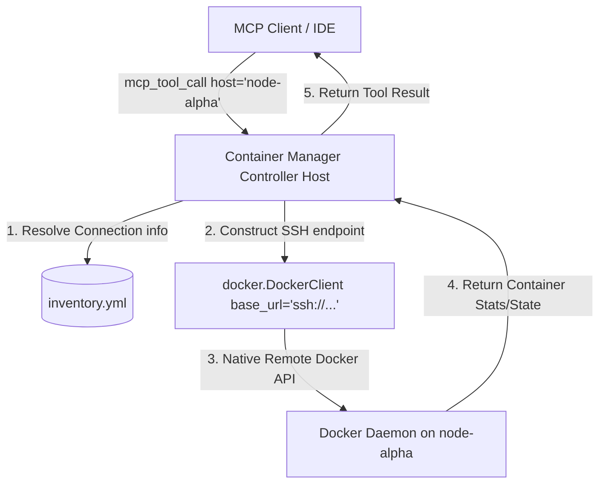
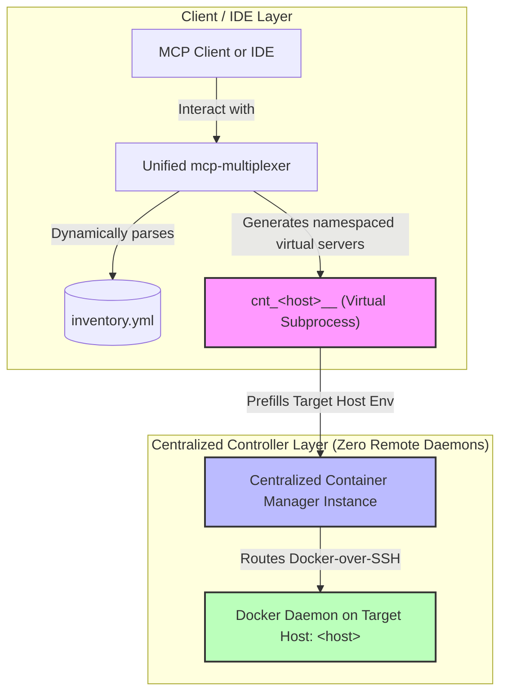

# Multi-Host Remote Docker Architecture

This document describes the design, configuration, and execution lifecycle of the **Zero-Script Multi-Host Container Control Plane** within `container-manager-mcp`.

---

## 1. Architectural Overview

Managing Docker, Docker Swarm, and Podman containers across multiple servers typically requires installing and exposing Docker ports globally, or setting up complex TLS credentials on every single remote host.

`container-manager-mcp` bypasses this complexity by leveraging **Docker over SSH** (using standard `ssh://` endpoints) coupled with a unified local inventory configuration:



### Pre-bound Virtual Host Namespacing (Multiplexer Integration)

To optimize the developer and AI agent experience in IDEs (like Antigravity), we avoid requiring the AI agent to remember to supply `host` explicitly on every call. Instead, the `mcp-multiplexer` reads `inventory.yml` and exposes host-specific **pre-bound virtual sub-servers** using namespaced prefixes (e.g. `cnt_r510__list_containers`).



This virtual namespacing maintains a single centralized executable on the controller host with zero remote daemons.

### Key Design Pillars:
- **Centralized Master Instance**: Run a single master instance of `container-manager-mcp` on the controller.
- **Zero TLS/TCP Exposes**: There is no need to open Docker's TCP socket port (`2376`/`2375`) on remote hosts. Remote communication is fully encrypted and transported over standard SSH (port `22`).
- **Shared Unified Inventory**: Shares the same standard inventory (`inventory.yml`, with a legacy `inventory.yaml` fallback) utilized by `systems-manager` and `tunnel-manager`. Manage it with `tunnel-manager inventory init|doctor`.

---

## 2. Configuration & Inventory Schema

Host connection definitions are parsed from the shared inventory (`inventory.yml`, with a legacy `inventory.yaml` fallback). The XDG-standard directory is searched by default to achieve a single source of truth.

### Search Paths (first match wins):
1. `~/.config/agent-utilities/inventory.yml` (preferred)
2. `~/.config/agent-utilities/inventory.yaml` (legacy fallback)

### Inventory Format:
Create or edit your inventory file at `~/.config/agent-utilities/inventory.yml` (the
fastest way is `tunnel-manager inventory init`). Host
aliases are **top-level keys** (no `hosts:` wrapper) — this is the flat form the shared
`HostManager` loader expects:

```yaml
node-alpha:
  hostname: "198.51.100.10"
  port: 22
  user: "ubuntu"
  key_path: "${SSH_KEY_PATH}"
node-beta:
  hostname: "192.0.2.5"
  port: 2222
  user: "admin"
  identity_file: "${SSH_IDENTITY_FILE}"
```

The richer **Ansible-style** layout (group `vars`, `children`) is also supported —
see tunnel-manager's [inventory tutorial](https://knuckles-team.github.io/tunnel-manager/inventory/)
and `inventory.example.yaml` for the full schema and recognized keys. Because the file
is shared, the same inventory drives `tunnel-manager`, `systems-manager`, and the
`ssh-bootstrap` skill — define each host once.

---

## 3. Remote Client Hooking Lifecycle

When a tool is invoked with a non-empty `host` parameter (e.g., `host="node-alpha"`):
1. `container-manager-mcp` intercepts the tool request and parses `node-alpha` from the local inventory.
2. It constructs the SSH URL: `ssh://user@hostname:port`.
3. It passes this connection URL to `docker.DockerClient(base_url=...)`.
4. The client routes all subsequent API commands (list images, pull images, deploy stacks, prune volumes) securely over the SSH tunnel.

---

## 4. Usage in MCP Clients (e.g. Cursor / Claude Desktop)

Pass the target `host` argument as part of standard tool payloads:

```json
{
  "name": "cm_container_operations",
  "arguments": {
    "action": "list_containers",
    "all_containers": true,
    "host": "node-alpha"
  }
}
```

This ensures full isolation, extreme simplicity, and zero configuration drift across your application environment.

---

## 5. Kubernetes Kubeconfig Contexts

The inventory model above (`host="node-alpha"` resolved from `inventory.yml`) is specific to **Docker and
Podman** — it routes a standard engine API call over an SSH tunnel to a remote daemon. **Kubernetes does not
use it.** A Kubernetes API server is already a network-reachable, authenticated endpoint described by your
**kubeconfig**, so `container-manager-mcp` targets clusters the Kubernetes-native way instead:

| | Docker / Podman (remote host) | Kubernetes (remote / multi cluster) |
|---|---|---|
| Targeting mechanism | `host` argument → `inventory.yml` alias → SSH tunnel | kubeconfig **context** name |
| Config source | `~/.config/agent-utilities/inventory.yml` (shared with `tunnel-manager` / `systems-manager`) | `~/.kube/config` (or `CONTAINER_MANAGER_KUBECONTEXT` / `K8S_CONTEXTS`) |
| Transport | Docker/Podman engine API over `ssh://` | Kubernetes API server over TLS (standard kubeconfig auth) |
| Single-target env var | `CONTAINER_MANAGER_HOST` (Docker) / `CONTAINER_MANAGER_PODMAN_BASE_URL` (Podman) | `CONTAINER_MANAGER_KUBECONTEXT` |
| Multi-target | N/A per-call (one host per call via `host=`) | `K8S_CONTEXTS` (`name=kubeconfig_context;…`) + `cm_multi_context` for parallel fan-out |

For a **single** Kubernetes cluster, set `CONTAINER_MANAGER_TYPE=kubernetes` and optionally
`CONTAINER_MANAGER_KUBECONTEXT` to the kubeconfig context name (empty = current-context). Every `cm_k8s_*`
tool call operates against that context.

For **multiple** clusters — e.g. comparing or migrating workloads between `staging` and `prod` — configure
`K8S_CONTEXTS` as a `name=kubeconfig_context;…` map (with `DEFAULT_K8S_CONTEXT` for the implicit default) and
use `cm_multi_context`, which fans a call out across the configured contexts in parallel (alongside
`DOCKER_CONTEXTS` / `SWARM_CONTEXTS` for the Docker/Swarm side of the same tool). See [Kubernetes](kubernetes.md)
and [Usage → Multi-context](usage.md#multi-context) for the full tool surface and worked examples.

**In short:** remote Docker/Podman hosts are reached through the shared **host inventory**; remote/multiple
Kubernetes clusters are reached through **kubeconfig contexts**. The two mechanisms are independent and can be
used side by side (e.g. `CONTAINER_MANAGER_TYPE=docker` with `host=` for a Docker fleet, while a separate
`cm_k8s_*` call targets a Kubernetes cluster via `CONTAINER_MANAGER_KUBECONTEXT`).
